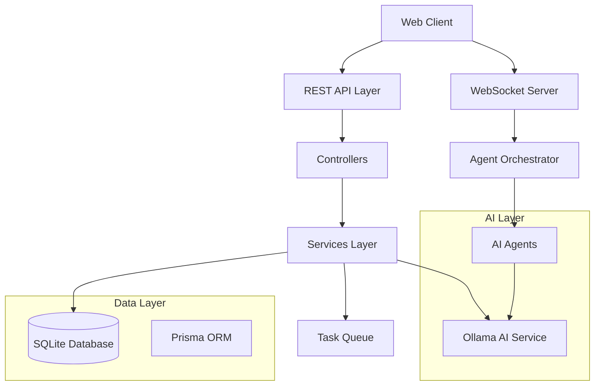

# Design Document

## Overview

The Billion Dollar Idea Platform is architected as a modern TypeScript-based system that orchestrates AI agents through a structured pipeline to transform business ideas into comprehensive venture plans. The system uses a microservices-inspired modular architecture with clear separation of concerns, real-time communication capabilities, and robust AI integration.

## Architecture

### High-Level Architecture



### System Components

1. **API Layer**: Express.js REST endpoints for CRUD operations
2. **WebSocket Layer**: Real-time communication for progress updates
3. **Service Layer**: Business logic and orchestration
4. **Data Layer**: SQLite database with Prisma ORM
5. **AI Layer**: Ollama integration and agent management
6. **Agent Orchestrator**: Pipeline management and task coordination

## Components and Interfaces

### Core Interfaces

```typescript
// Core domain interfaces
interface Project {
  id: string;
  name: string;
  idea: string;
  userId: string;
  status: ProjectStatus;
  currentStage: number;
  createdAt: Date;
  updatedAt: Date;
}

interface Task {
  id: string;
  name: string;
  status: TaskStatus;
  stage: number;
  agent: string;
  projectId: string;
  result?: string;
  error?: string;
}

interface Artifact {
  id: string;
  name: string;
  content: string;
  type: ArtifactType;
  projectId: string;
}

interface Agent {
  id: string;
  name: string;
  description: string;
  stage: number;
  prompt: string;
  execute(context: AgentContext): Promise<AgentResult>;
}

// Service interfaces
interface IOllamaService {
  generateContent(prompt: string, context?: any): Promise<string>;
  isHealthy(): Promise<boolean>;
}

interface IAgentOrchestrator {
  startProject(projectId: string): Promise<void>;
  executeStage(projectId: string, stage: number): Promise<void>;
  getProgress(projectId: string): Promise<ProjectProgress>;
}

interface IProjectService {
  createProject(idea: string, userId: string): Promise<Project>;
  getProject(id: string): Promise<Project | null>;
  updateProjectStatus(id: string, status: ProjectStatus): Promise<void>;
}
```

### Agent System Design

#### Agent Base Class

```typescript
abstract class BaseAgent implements Agent {
  constructor(
    public id: string,
    public name: string,
    public description: string,
    public stage: number,
    public prompt: string
  ) {}

  abstract execute(context: AgentContext): Promise<AgentResult>;

  protected async callOllama(prompt: string): Promise<string> {
    // Ollama integration with retry logic
  }

  protected createArtifact(name: string, content: string, type: ArtifactType): Artifact {
    // Artifact creation helper
  }
}
```

#### Specialized Agents

Each stage will have specialized agents:

**Stage 1: Input Processing**
- `IdeaStructuringAgent`: Converts raw ideas into structured project descriptions

**Stage 2: Validation & Strategy**
- `MarketResearchAgent`: Analyzes market viability and competition
- `TechnicalArchitectureAgent`: Proposes technical implementation approach

**Stage 3: Development**
- `UIUXDesignAgent`: Creates design mockups and user experience guidelines
- `FrontendDevelopmentAgent`: Generates frontend code and component structure
- `BackendDevelopmentAgent`: Creates API specifications and backend architecture
- `DatabaseDesignAgent`: Designs database schema and data models
- `QAAgent`: Develops testing strategies and quality assurance plans

**Stage 4: Go-to-Market**
- `BusinessFormationAgent`: Outlines legal and business structure requirements
- `MarketingContentAgent`: Creates marketing copy and content strategies
- `SalesFunnelAgent`: Designs customer acquisition and conversion funnels

**Stage 5: Operations**
- `CustomerSupportAgent`: Develops customer service frameworks
- `AnalyticsAgent`: Defines KPIs and analytics implementation
- `FinancialManagementAgent`: Creates financial projections and management plans

**Stage 6: Self-Improvement**
- `ContinuousMonitoringAgent`: Establishes monitoring and alerting systems
- `OptimizationAgent`: Identifies improvement opportunities and optimization strategies

### Orchestrator Design

```typescript
class AgentOrchestrator implements IAgentOrchestrator {
  private agents: Map<number, Agent[]> = new Map();
  private taskQueue: TaskQueue;
  private websocketService: WebSocketService;

  async startProject(projectId: string): Promise<void> {
    // Initialize project pipeline
    // Create tasks for all stages
    // Start with Stage 1
  }

  async executeStage(projectId: string, stage: number): Promise<void> {
    const stageAgents = this.agents.get(stage) || [];
    const tasks = await this.createTasksForStage(projectId, stage, stageAgents);
    
    // Execute agents in parallel where possible
    const results = await Promise.allSettled(
      tasks.map(task => this.executeTask(task))
    );
    
    // Process results and move to next stage
    await this.processStageResults(projectId, stage, results);
  }

  private async executeTask(task: Task): Promise<AgentResult> {
    // Execute individual agent task
    // Handle errors and retries
    // Update task status via WebSocket
  }
}
```

## Data Models

### Database Schema Design

The Prisma schema supports the complete data model:

```prisma
model User {
  id        String   @id @default(cuid())
  email     String   @unique
  createdAt DateTime @default(now())
  updatedAt DateTime @updatedAt
  projects  Project[]
}

model Project {
  id          String     @id @default(cuid())
  name        String
  idea        String
  status      String     @default("CREATED")
  currentStage Int       @default(1)
  userId      String
  user        User       @relation(fields: [userId], references: [id])
  tasks       Task[]
  artifacts   Artifact[]
  createdAt   DateTime   @default(now())
  updatedAt   DateTime   @updatedAt
}

model Task {
  id          String   @id @default(cuid())
  name        String
  status      String   @default("PENDING")
  stage       Int
  agent       String
  result      String?
  error       String?
  projectId   String
  project     Project  @relation(fields: [projectId], references: [id])
  createdAt   DateTime @default(now())
  updatedAt   DateTime @updatedAt
}

model Artifact {
  id          String   @id @default(cuid())
  name        String
  content     String
  type        String
  projectId   String
  project     Project  @relation(fields: [projectId], references: [id])
  createdAt   DateTime @default(now())
  updatedAt   DateTime @updatedAt
}

model Agent {
  id          String   @id @default(cuid())
  name        String   @unique
  description String
  stage       Int
  prompt      String
  isActive    Boolean  @default(true)
  createdAt   DateTime @default(now())
  updatedAt   DateTime @updatedAt
}
```

### Data Flow

1. **Project Creation**: User submits idea → Project created → Pipeline initiated
2. **Task Execution**: Orchestrator creates tasks → Agents execute → Results stored as artifacts
3. **Progress Updates**: Task status changes → WebSocket broadcasts → Client updates
4. **Stage Progression**: Stage completes → Next stage initiated → Process repeats

## Error Handling

### Error Categories and Strategies

1. **API Errors**
   - Input validation errors: Return 400 with detailed field errors
   - Authentication errors: Return 401 with clear messaging
   - Resource not found: Return 404 with helpful suggestions
   - Server errors: Return 500 with sanitized error information

2. **Database Errors**
   - Connection failures: Implement connection pooling and retry logic
   - Transaction failures: Use Prisma transactions with rollback
   - Constraint violations: Return meaningful validation messages

3. **AI Service Errors**
   - Ollama unavailable: Queue requests and retry with exponential backoff
   - Generation failures: Retry with modified prompts, fallback to simpler requests
   - Timeout errors: Implement request timeouts and circuit breaker pattern

4. **Agent Execution Errors**
   - Individual agent failures: Log error, mark task as failed, continue pipeline
   - Stage failures: Attempt retry, then skip to next stage with warning
   - Critical failures: Pause pipeline, notify user, allow manual intervention

### Error Recovery Mechanisms

```typescript
class ErrorHandler {
  static async handleAgentError(error: Error, task: Task): Promise<void> {
    // Log error with context
    // Update task status
    // Notify via WebSocket
    // Determine if pipeline should continue
  }

  static async handleOllamaError(error: Error, retryCount: number): Promise<string> {
    // Implement exponential backoff
    // Try alternative prompts
    // Fallback to cached responses if available
  }
}
```

## Testing Strategy

### Unit Testing

- **Services**: Mock external dependencies (database, Ollama API)
- **Controllers**: Test request/response handling and validation
- **Agents**: Test prompt generation and result processing
- **Utilities**: Test helper functions and error handling

### Integration Testing

- **API Endpoints**: Test complete request/response cycles
- **Database Operations**: Test Prisma queries and transactions
- **WebSocket Communication**: Test real-time event broadcasting
- **Agent Pipeline**: Test end-to-end orchestration flow

### Test Structure

```typescript
// Example test structure
describe('AgentOrchestrator', () => {
  describe('executeStage', () => {
    it('should execute all agents in parallel for a stage', async () => {
      // Test parallel execution
    });

    it('should handle individual agent failures gracefully', async () => {
      // Test error handling
    });

    it('should progress to next stage after completion', async () => {
      // Test stage progression
    });
  });
});
```

### Performance Testing

- Load testing for concurrent project processing
- Stress testing for Ollama API integration
- WebSocket connection limits and message throughput
- Database query performance under load

## Security Considerations

### API Security

- Input validation and sanitization for all endpoints
- Rate limiting to prevent abuse
- CORS configuration for frontend integration
- Request logging for audit trails

### Data Security

- Environment variable management for sensitive configuration
- Database connection security
- Artifact content sanitization to prevent XSS
- User data isolation and access controls

### AI Integration Security

- Prompt injection prevention
- Content filtering for generated artifacts
- API key management for Ollama service
- Request/response logging for AI interactions

## Performance Optimization

### Caching Strategy

- Agent prompt templates cached in memory
- Frequently accessed project data cached with Redis (future enhancement)
- Ollama response caching for similar prompts
- Database query result caching for read-heavy operations

### Scalability Considerations

- Horizontal scaling through containerization
- Database connection pooling
- Task queue implementation for background processing
- WebSocket connection management and clustering

### Monitoring and Metrics

- Application performance monitoring (APM)
- Database query performance tracking
- Ollama API response times and success rates
- WebSocket connection metrics and message throughput