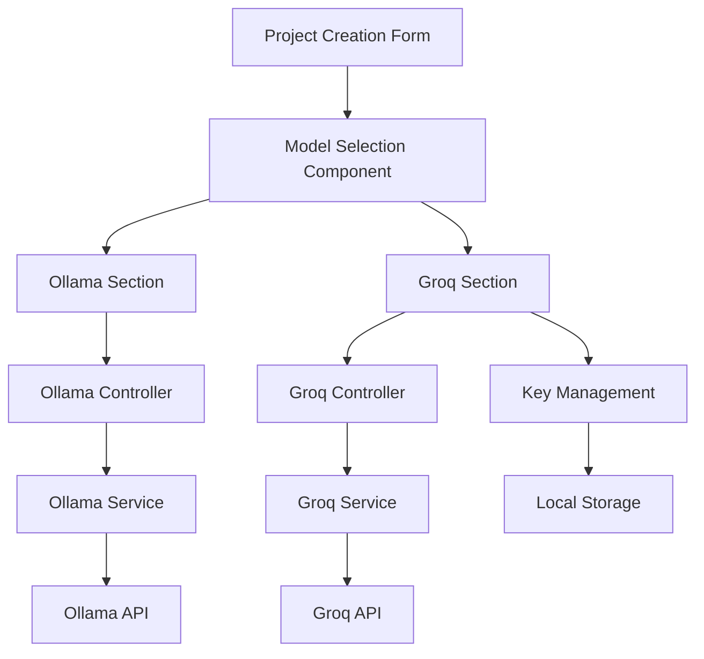

# Design Document

## Overview

This design extends the existing AI model selection system to support both Ollama (local) and Groq (cloud-based) models. The implementation follows the established patterns in the codebase, creating a parallel service architecture for Groq while maintaining the existing Ollama functionality. The UI will be enhanced to clearly separate local and cloud model options, with secure API key management for Groq authentication.

## Architecture

### High-Level Architecture



### Service Layer Architecture

The design follows the existing service pattern:
- **GroqService**: Mirrors OllamaService structure with Groq SDK integration
- **GroqController**: Provides REST endpoints for Groq operations
- **Enhanced ModelSelector**: Extended to handle both model types
- **Secure Key Storage**: Client-side encrypted storage for API keys

## Components and Interfaces

### 1. GroqService

```typescript
interface IGroqService {
  generateContent(prompt: string, context?: any): Promise<string>;
  isHealthy(): Promise<boolean>;
  validateApiKey(apiKey: string): Promise<boolean>;
  getServiceInfo(): Promise<GroqServiceInfo>;
  getMetrics(): GroqMetrics;
}
```

**Key Features:**
- Groq SDK integration using "openai/gpt-oss-120b" model
- API key validation and management
- Error handling and retry logic consistent with OllamaService
- Circuit breaker pattern for reliability
- Comprehensive logging and metrics

### 2. GroqController

```typescript
class GroqController {
  validateApiKey(req: Request, res: Response): Promise<void>;
  getHealth(req: Request, res: Response): Promise<void>;
  getModelInfo(req: Request, res: Response): Promise<void>;
}
```

**Endpoints:**
- `POST /api/groq/validate-key` - Validate API key
- `GET /api/groq/health` - Service health check
- `GET /api/groq/model` - Get model information

### 3. Enhanced ModelSelector Component

**New Structure:**
```html
<div class="model-selector">
  <div class="model-section ollama-section">
    <h3>Ollama Models (Local)</h3>
    <select id="ollama-models">...</select>
  </div>
  
  <div class="model-section groq-section">
    <h3>Groq Models (Cloud)</h3>
    <div class="api-key-input">
      <input type="password" placeholder="Enter Groq API Key">
      <button>Save Key</button>
    </div>
    <select id="groq-models" disabled>
      <option value="openai/gpt-oss-120b">openai/gpt-oss-120b</option>
    </select>
  </div>
</div>
```

**Enhanced Functionality:**
- Separate sections for Ollama and Groq models
- API key input with validation
- Secure key storage using Web Crypto API
- Model selection state management
- Visual indicators for local vs cloud models

### 4. Key Management System

**Security Features:**
- Client-side encryption using Web Crypto API
- Secure storage in localStorage with encryption
- Key validation before storage
- Automatic key loading on page refresh
- Clear key management (update/delete)

## Data Models

### GroqServiceInfo
```typescript
interface GroqServiceInfo {
  model: string;
  apiKeyConfigured: boolean;
  isHealthy: boolean;
  maxRetries: number;
  timeout: number;
  circuitBreakerState: string;
  metrics: GroqMetrics;
}
```

### GroqMetrics
```typescript
interface GroqMetrics {
  totalRequests: number;
  successfulRequests: number;
  failedRequests: number;
  averageResponseTime: number;
  lastRequestTime: Date;
  circuitBreakerTrips: number;
  errorRate: number;
  successRate: number;
}
```

### Enhanced Project Model
```typescript
interface Project {
  // ... existing fields
  modelType: 'ollama' | 'groq';
  modelName: string;
  // ... other fields
}
```

## Error Handling

### Groq-Specific Error Types
- **API_KEY_INVALID**: Invalid or expired API key
- **API_KEY_MISSING**: No API key provided
- **GROQ_SERVICE_ERROR**: Groq API service errors
- **RATE_LIMIT_EXCEEDED**: API rate limiting
- **QUOTA_EXCEEDED**: API quota exceeded

### Error Recovery Strategies
1. **API Key Errors**: Prompt user to re-enter key
2. **Rate Limiting**: Exponential backoff with user notification
3. **Service Errors**: Fallback to Ollama if available
4. **Network Errors**: Retry with circuit breaker pattern

### User-Friendly Error Messages
- "Invalid API key. Please check your Groq API key and try again."
- "Groq service is temporarily unavailable. Try using Ollama models instead."
- "API rate limit reached. Please wait a moment before trying again."

## Testing Strategy

### Unit Tests
- **GroqService**: API integration, error handling, circuit breaker
- **GroqController**: Endpoint responses, validation logic
- **ModelSelector**: UI interactions, key management, model selection
- **Key Management**: Encryption/decryption, storage operations

### Integration Tests
- **End-to-End Model Selection**: Complete flow from UI to service
- **API Key Validation**: Real API key validation flow
- **Project Creation**: Creating projects with Groq models
- **Error Scenarios**: Network failures, invalid keys, service errors

### Security Tests
- **Key Storage Security**: Encryption validation, storage isolation
- **API Key Validation**: Proper key format and authentication
- **Input Sanitization**: Prevent injection attacks
- **HTTPS Requirements**: Ensure secure transmission

### Performance Tests
- **Response Times**: Compare Ollama vs Groq performance
- **Concurrent Requests**: Multiple simultaneous API calls
- **Memory Usage**: Key storage and component efficiency
- **Network Resilience**: Handling network interruptions

## Implementation Phases

### Phase 1: Backend Services
1. Create GroqService with Groq SDK integration
2. Implement GroqController with validation endpoints
3. Add error handling and logging
4. Create comprehensive unit tests

### Phase 2: Frontend Integration
1. Enhance ModelSelector component
2. Implement secure key management
3. Update project creation form
4. Add visual indicators and styling

### Phase 3: Integration & Testing
1. End-to-end integration testing
2. Security validation
3. Performance optimization
4. User experience refinement

### Phase 4: Documentation & Deployment
1. Update API documentation
2. Create user guides
3. Deploy and monitor
4. Gather user feedback

## Security Considerations

### API Key Protection
- Never store keys in plain text
- Use Web Crypto API for client-side encryption
- Implement key rotation capabilities
- Clear keys on logout/session end

### Network Security
- Require HTTPS for Groq API calls
- Validate SSL certificates
- Implement request signing if required
- Monitor for suspicious activity

### Input Validation
- Sanitize all user inputs
- Validate API key format
- Prevent code injection
- Rate limit API calls

## Performance Considerations

### Optimization Strategies
- Cache API key validation results
- Implement request debouncing
- Use connection pooling for HTTP requests
- Optimize component re-rendering

### Monitoring
- Track API response times
- Monitor error rates
- Log performance metrics
- Set up alerting for issues

## Compatibility

### Browser Support
- Modern browsers with Web Crypto API support
- Graceful degradation for older browsers
- Progressive enhancement approach
- Accessibility compliance

### Existing System Integration
- Maintain backward compatibility with Ollama
- Preserve existing project data
- Seamless migration path
- No breaking changes to current functionality