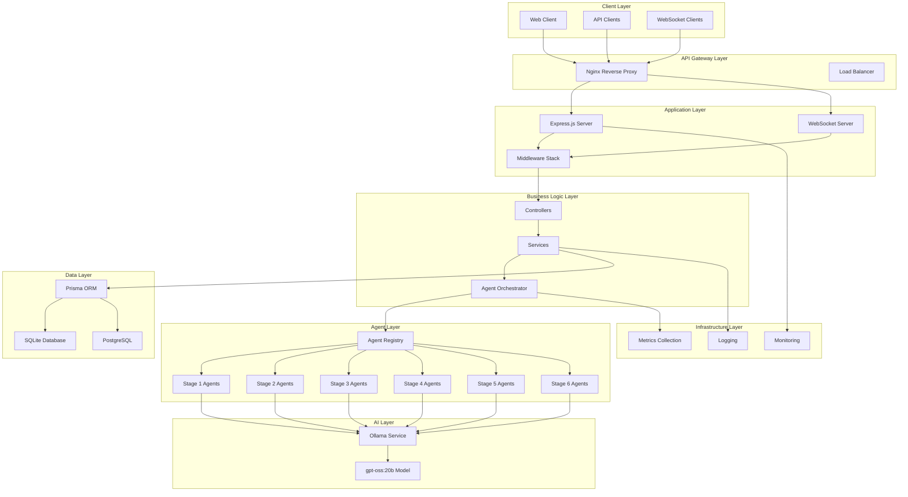
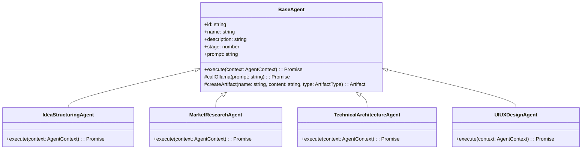
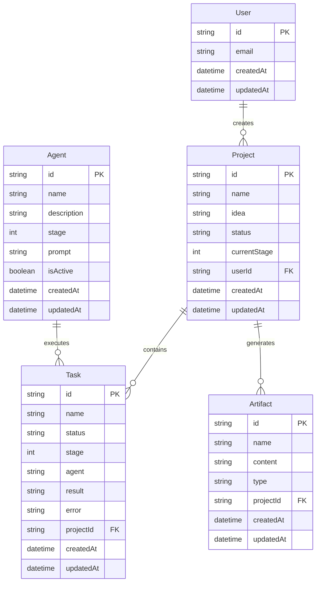
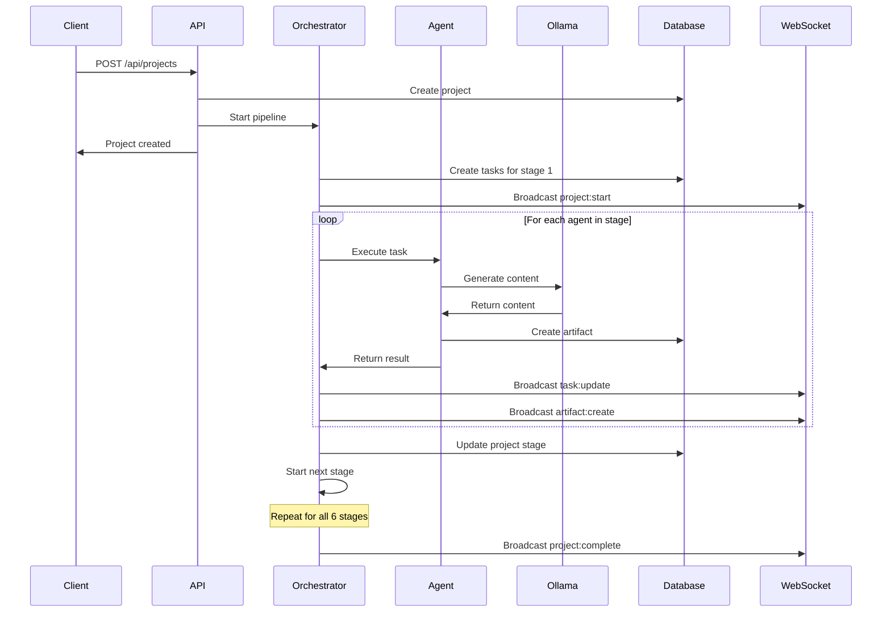
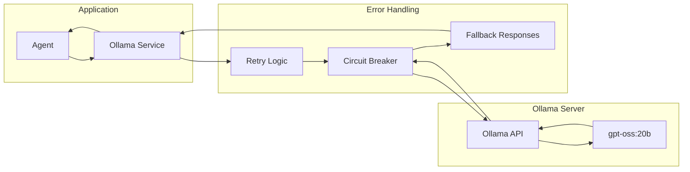
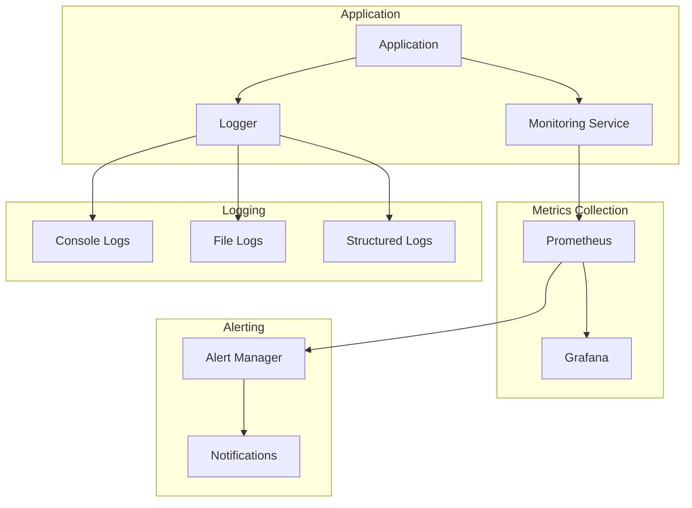
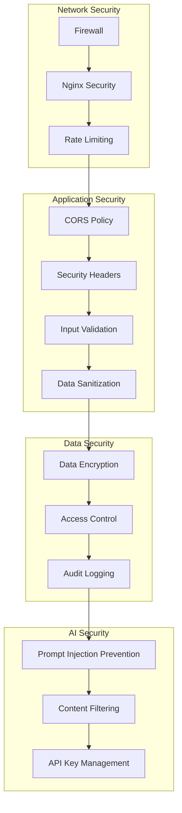
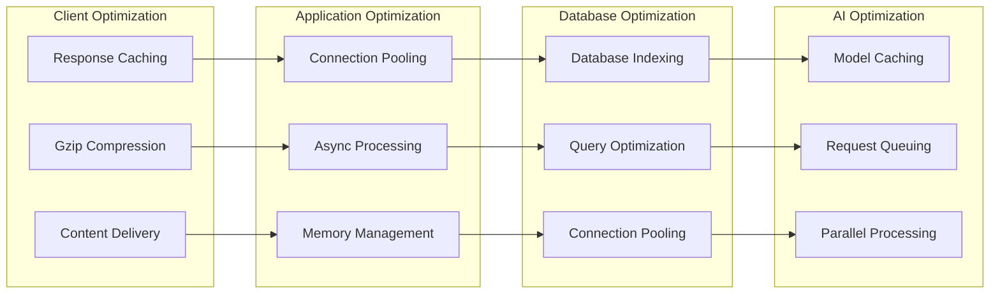
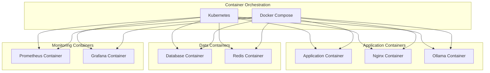
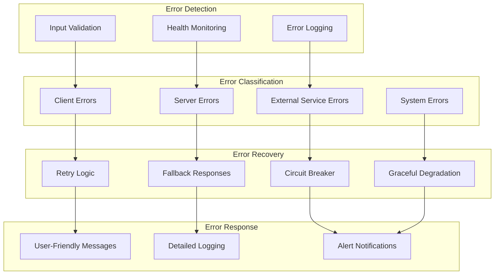

# System Architecture Overview

## Introduction

The Billion Dollar Idea Platform is a sophisticated AI-powered system designed to transform raw business ideas into comprehensive venture plans through autonomous agent orchestration. This document provides a detailed overview of the system architecture, design decisions, and technical implementation.

## High-Level Architecture

## Core Components

### 1. API Layer

#### Express.js Server
- **Purpose**: HTTP API server handling REST endpoints
- **Responsibilities**:
  - Request routing and validation
  - Authentication and authorization
  - Rate limiting and security headers
  - Error handling and response formatting
- **Key Features**:
  - CORS configuration
  - Request/response logging
  - Health check endpoints
  - Graceful shutdown handling

#### WebSocket Server
- **Purpose**: Real-time communication with clients
- **Responsibilities**:
  - Connection management
  - Event broadcasting
  - Message queuing
  - Connection state synchronization
- **Events**:
  - `project:start` - Project pipeline initiation
  - `task:update` - Task status changes
  - `artifact:create` - New artifact generation
  - `project:complete` - Pipeline completion
  - `error` - Error notifications

### 2. Business Logic Layer

#### Controllers
- **ProjectController**: Project CRUD operations and lifecycle management
- **AgentController**: Agent information and statistics
- **Responsibilities**:
  - Request validation
  - Business logic coordination
  - Response formatting
  - Error handling

#### Services
- **ProjectService**: Core project management logic
- **AgentOrchestrator**: Pipeline execution and coordination
- **WebSocketService**: Real-time communication management
- **DatabaseService**: Database operations and connection management
- **OllamaService**: AI model integration and communication

### 3. Agent System

#### Agent Architecture

#### Agent Stages

**Stage 1: Input Processing**
- `IdeaStructuringAgent`: Converts raw ideas into structured descriptions

**Stage 2: Validation & Strategy**
- `MarketResearchAgent`: Market analysis and competition research
- `TechnicalArchitectureAgent`: Technical feasibility and architecture

**Stage 3: Development**
- `UIUXDesignAgent`: User interface and experience design
- `FrontendDevelopmentAgent`: Frontend architecture and implementation
- `BackendDevelopmentAgent`: Backend services and API design
- `DatabaseDesignAgent`: Data modeling and database schema
- `QAAgent`: Testing strategies and quality assurance

**Stage 4: Go-to-Market**
- `BusinessFormationAgent`: Legal structure and business formation
- `MarketingContentAgent`: Marketing strategies and content
- `SalesFunnelAgent`: Customer acquisition and conversion

**Stage 5: Operations**
- `CustomerSupportAgent`: Support systems and processes
- `AnalyticsAgent`: Metrics and analytics implementation
- `FinancialManagementAgent`: Financial planning and management

**Stage 6: Self-Improvement**
- `ContinuousMonitoringAgent`: Monitoring and alerting systems
- `OptimizationAgent`: Performance optimization strategies

### 4. Data Layer

#### Database Schema

#### Data Flow

### 5. AI Integration

#### Ollama Service Integration

#### AI Service Features
- **Retry Logic**: Exponential backoff for failed requests
- **Circuit Breaker**: Prevents cascade failures
- **Health Monitoring**: Continuous service availability checks
- **Request Queuing**: Handles high-volume requests
- **Response Caching**: Optimizes repeated similar requests

### 6. Monitoring and Observability

#### Monitoring Architecture

#### Metrics Collected
- **Application Metrics**: Request rates, response times, error rates
- **Agent Metrics**: Execution times, success rates, stage distribution
- **System Metrics**: CPU, memory, disk usage
- **Database Metrics**: Query performance, connection pool status
- **WebSocket Metrics**: Connection counts, message rates

## Design Patterns and Principles

### 1. Architectural Patterns

#### Microservices-Inspired Modular Architecture
- **Separation of Concerns**: Clear boundaries between layers
- **Single Responsibility**: Each component has a focused purpose
- **Dependency Injection**: Loose coupling between components
- **Interface Segregation**: Well-defined interfaces between layers

#### Event-Driven Architecture
- **WebSocket Events**: Real-time communication
- **Agent Orchestration**: Event-based pipeline progression
- **Error Handling**: Event-driven error propagation
- **Monitoring**: Event-based metrics collection

### 2. Design Patterns

#### Factory Pattern
- **AgentFactory**: Creates agent instances based on configuration
- **ServiceFactory**: Initializes services with dependencies

#### Observer Pattern
- **WebSocket Broadcasting**: Event notification system
- **Monitoring**: Metrics collection and alerting

#### Strategy Pattern
- **Agent Execution**: Different strategies for different agent types
- **Error Handling**: Different strategies for different error types

#### Circuit Breaker Pattern
- **Ollama Integration**: Prevents cascade failures
- **Database Operations**: Handles connection issues

### 3. SOLID Principles

#### Single Responsibility Principle
- Each class has a single, well-defined responsibility
- Controllers handle HTTP concerns only
- Services contain business logic only
- Agents focus on specific AI tasks only

#### Open/Closed Principle
- New agents can be added without modifying existing code
- New middleware can be added to the pipeline
- New monitoring metrics can be added without changes

#### Liskov Substitution Principle
- All agents implement the same interface
- Services can be substituted with mock implementations
- Database implementations can be swapped

#### Interface Segregation Principle
- Interfaces are focused and minimal
- Clients depend only on methods they use
- No forced dependencies on unused functionality

#### Dependency Inversion Principle
- High-level modules don't depend on low-level modules
- Both depend on abstractions
- Abstractions don't depend on details

## Security Architecture

### 1. Security Layers

### 2. Security Measures

#### Network Security
- **Firewall Configuration**: Restricted port access
- **Nginx Security**: Request filtering and rate limiting
- **SSL/TLS**: Encrypted communication
- **CORS Policy**: Cross-origin request control

#### Application Security
- **Input Validation**: Comprehensive request validation
- **Output Sanitization**: XSS prevention
- **Security Headers**: HSTS, CSP, X-Frame-Options
- **Error Handling**: Secure error responses

#### Data Security
- **Database Security**: Parameterized queries, connection encryption
- **Access Control**: Role-based permissions
- **Audit Logging**: Comprehensive activity tracking
- **Data Encryption**: Sensitive data protection

## Performance Architecture

### 1. Performance Optimization

### 2. Scalability Considerations

#### Horizontal Scaling
- **Stateless Design**: No server-side session state
- **Load Balancing**: Multiple application instances
- **Database Sharding**: Distributed data storage
- **Microservices**: Independent service scaling

#### Vertical Scaling
- **Resource Optimization**: Efficient memory and CPU usage
- **Connection Pooling**: Optimized database connections
- **Caching**: Reduced computational overhead
- **Async Processing**: Non-blocking operations

## Deployment Architecture

### 1. Container Architecture

### 2. Cloud Architecture

#### Multi-Cloud Deployment
- **AWS**: ECS, RDS, CloudWatch
- **Google Cloud**: Cloud Run, Cloud SQL, Stackdriver
- **Azure**: Container Instances, Azure Database, Monitor

#### Infrastructure as Code
- **Terraform**: Infrastructure provisioning
- **Kubernetes**: Container orchestration
- **Helm**: Application deployment
- **Docker**: Containerization

## Error Handling and Resilience

### 1. Error Handling Strategy

### 2. Resilience Patterns

#### Circuit Breaker
- **Ollama Service**: Prevents cascade failures
- **Database Operations**: Handles connection issues
- **External APIs**: Manages third-party service failures

#### Retry with Exponential Backoff
- **AI Requests**: Handles temporary service unavailability
- **Database Operations**: Manages connection timeouts
- **WebSocket Connections**: Handles network issues

#### Bulkhead Pattern
- **Resource Isolation**: Separate thread pools for different operations
- **Error Isolation**: Failures in one component don't affect others
- **Performance Isolation**: Resource contention prevention

## Future Architecture Considerations

### 1. Scalability Enhancements

#### Microservices Migration
- **Service Decomposition**: Split into independent services
- **API Gateway**: Centralized request routing
- **Service Mesh**: Inter-service communication
- **Event Sourcing**: Audit trail and state reconstruction

#### Distributed Architecture
- **Message Queues**: Asynchronous processing
- **Event Streaming**: Real-time data processing
- **Distributed Caching**: Multi-level caching strategy
- **Database Sharding**: Horizontal data partitioning

### 2. AI/ML Enhancements

#### Model Management
- **Model Versioning**: A/B testing and rollback capabilities
- **Model Serving**: Optimized inference serving
- **Model Monitoring**: Performance and drift detection
- **AutoML**: Automated model improvement

#### Advanced AI Features
- **Multi-Modal AI**: Text, image, and voice processing
- **Reinforcement Learning**: Self-improving agents
- **Federated Learning**: Privacy-preserving model training
- **Edge AI**: Local model inference

### 3. Observability Enhancements

#### Advanced Monitoring
- **Distributed Tracing**: Request flow across services
- **Application Performance Monitoring**: Detailed performance insights
- **Business Metrics**: KPI tracking and analysis
- **Predictive Analytics**: Proactive issue detection

#### Intelligent Alerting
- **Anomaly Detection**: ML-based alert generation
- **Alert Correlation**: Intelligent alert grouping
- **Auto-Remediation**: Automated issue resolution
- **Capacity Planning**: Predictive resource scaling

This architecture overview provides a comprehensive understanding of the system design, implementation patterns, and future considerations for the Billion Dollar Idea Platform.